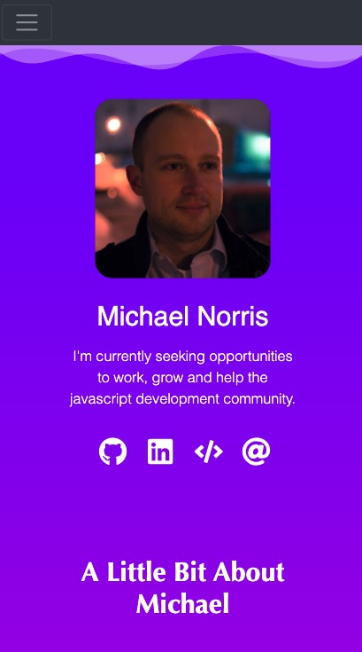
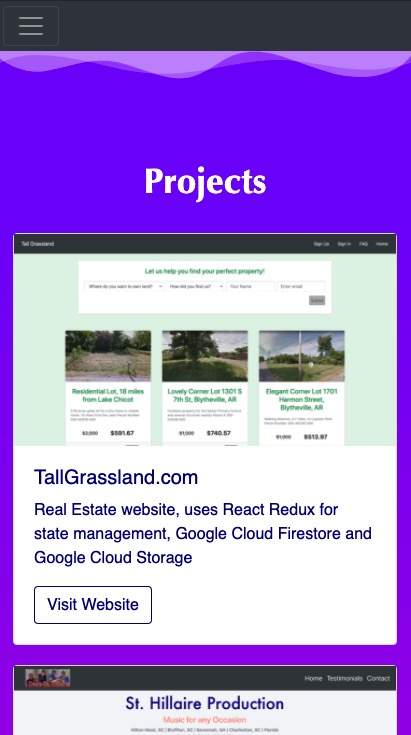

# Norris Portfolio

## Technology used
- React
- React Router
- Bootstrap
- CSS (Mobile-first responsive design and css variables)

## Project Screen Shots

## Reflection

The biggest take away from this project was, it's always good to have a wireframe or solid idea of a project before you get started. I spent too much time on items such as the navigation bar layout design and content design for the homepage. In the end, I am happy with how the project turned out.   
 

To be honest, the webpage background color is something I have struggled with on every project I have created. With this being a portfolio project, I really felt the need for the background to pop. One day on television, a commercial advertisement for a website caught my eye. At the time, I had no idea what to even call the design. After several attempts of asking questions on Stack Overflow and Reddit, I finally found what I was looking for, it was a SVG background. I found some cool sites online to help generate the design and color patterns. Within react and css, it took some time to fine tune the design, but I finally got the design down and I am happy. I really think it helps to make the design pop. 
 

## Available Scripts
This project was bootstrapped with [Create React App](https://github.com/facebook/create-react-app).

In the project directory, you can run:

### `npm run start`

Runs the app in the development mode. 
Open [http://localhost:3000](http://localhost:3000) to view it in the browser.

The page will reload if you make edits. 
You will also see any lint errors in the console.

### `npm run test`
Launches the test runner in the interactive watch mode. 
See the section about running tests for more information.

### `npm run build`

Builds the app for production to the `build` folder. 
It correctly bundles React in production mode and optimizes the build for the best performance.

The build is minified and the filenames include the hashes. 
Your app is ready to be deployed!

### `npm run eject`

Note: this is a one-way operation. Once you eject, you can’t go back! 

If you aren’t satisfied with the build tool and configuration choices, you can eject at  any time. This command will remove the single build dependency from your project.  

Instead, it will copy all the configuration files and the transitive dependencies  (Webpack, Babel, ESLint, etc) right into your project so you have full control over  them. All of the commands except eject will still work, but they will point to the  copied scripts so you can tweak them. At this point you’re on your own.  

You don’t have to ever use eject. The curated feature set is suitable for small and  middle deployments, and you shouldn’t feel obligated to use this feature. However we  understand that this tool wouldn’t be useful if you couldn’t customize it when  you are ready for it.  

